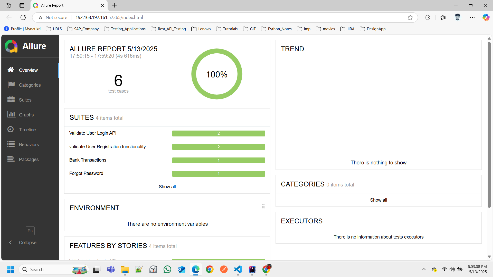
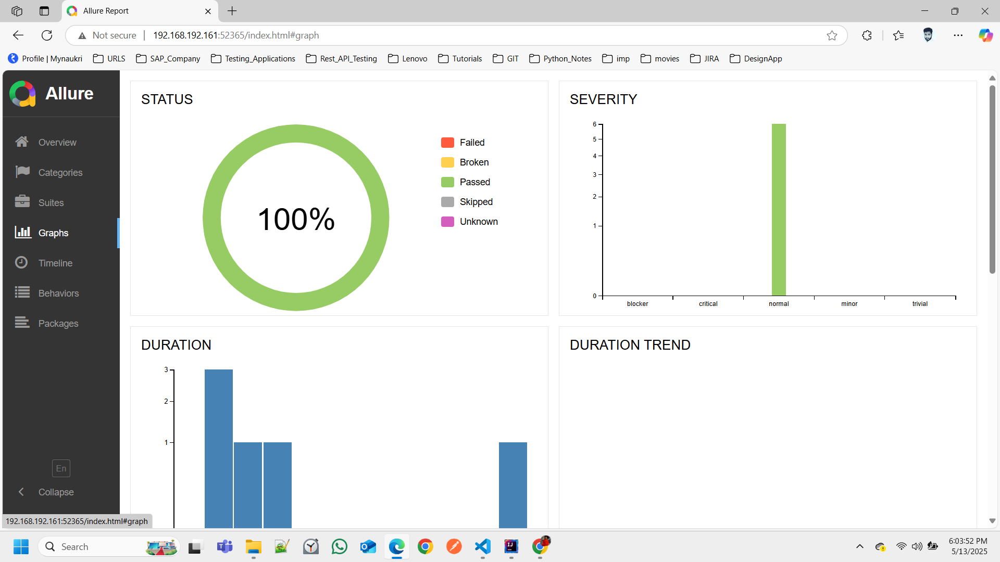
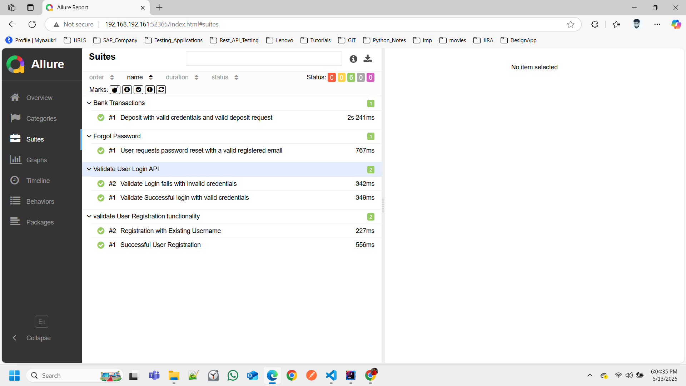
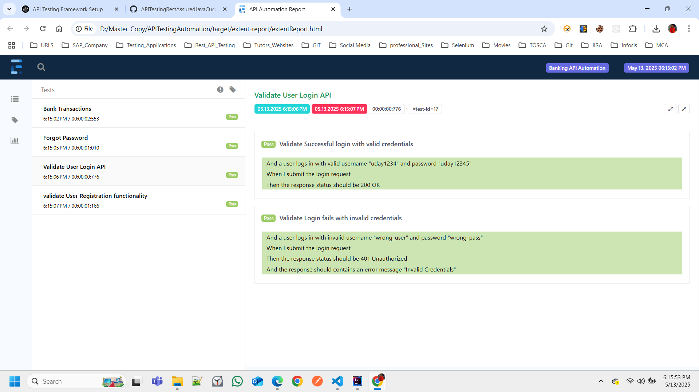
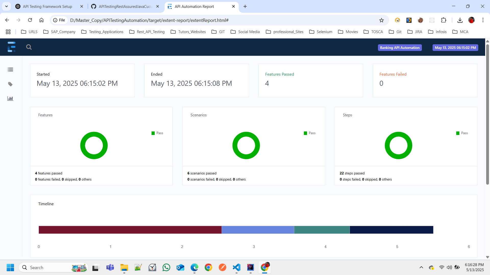

```markdown
# 🚀 API Testing Automation Framework

This project is a comprehensive REST API testing framework built using modern tools and libraries. It follows the Behavior-Driven Development (BDD) approach, enabling collaboration between developers, testers, and stakeholders by writing tests in plain English.

---

## 📚 Features

- **Behavior-Driven Development (BDD)**: Uses Cucumber to write human-readable test scenarios.
- **REST API Testing**: Built with RestAssured for seamless API interaction and validation.
- **Test Execution**: Powered by TestNG for flexible and parallel test execution.
- **Dynamic Test Data**: Utilizes the Faker library to generate random test data.
- **Reporting**: Generates detailed and interactive reports using Allure and Extent Reports.
- **CI/CD Integration**: Configured for Jenkins or GitHub Actions to enable automated test execution.

---

## 🛠️ Tech Stack and Dependencies

### **Programming Language**
- **Java**: Core Java is used for writing the framework and test logic.

### **Dependencies**
The following dependencies are added in the `pom.xml` file:

1. **Cucumber**:
   - **Purpose**: Enables BDD by allowing tests to be written in Gherkin syntax.
   - **Advantage**: Improves collaboration and makes tests readable for non-technical stakeholders.
   - **Key Libraries**:
     - `io.cucumber:cucumber-java`
     - `io.cucumber:cucumber-testng`

2. **RestAssured**:
   - **Purpose**: Simplifies REST API testing by providing a fluent API for HTTP requests and responses.
   - **Advantage**: Reduces boilerplate code for API testing.
   - **Key Library**: `io.rest-assured:rest-assured`

3. **TestNG**:
   - **Purpose**: Provides a robust testing framework for executing tests.
   - **Advantage**: Supports parallel execution, annotations, and flexible test configurations.
   - **Key Library**: `org.testng:testng`

4. **Faker**:
   - **Purpose**: Generates random test data (e.g., names, emails, phone numbers).
   - **Advantage**: Avoids hardcoding test data and ensures test independence.
   - **Key Library**: `com.github.javafaker:javafaker`

5. **Allure Reports**:
   - **Purpose**: Generates visually appealing and detailed test execution reports.
   - **Advantage**: Provides insights into test results with screenshots, logs, and step details.
   - **Key Library**: `io.qameta.allure:allure-testng`

6. **Extent Reports**:
   - **Purpose**: Creates customizable and interactive HTML reports.
   - **Advantage**: Offers detailed insights into test execution with graphs and charts.
   - **Key Library**: `com.aventstack:extentreports`

7. **JSON Parsing**:
   - **Purpose**: Parses JSON responses for validation.
   - **Key Library**: `com.fasterxml.jackson.core:jackson-databind`

---

## 📁 Project Structure

```
APITestingAutomation/
├── .github/
│   └── workflows/
│       └── ci.yml                  # CI/CD pipeline configuration
│
├── src/
│   ├── main/
│   │   ├── java/
│   │   │   ├── apiBaseService/     # Base classes for API services
│   │   │   ├── modelsRequest/      # Request payload models
│   │   │   ├── modelsResponse/     # Response mapping models
│   │   │   └── utility/            # Utility classes
│   │   └── resources/
│   │       ├── config/             # Configuration files
│   │       └── testData/           # Test data files
│
│   ├── test/
│   │   ├── java/
│   │   │   ├── steps/              # Step definitions for Cucumber
│   │   │   ├── testRunner/         # Test runners for executing feature files
│   │   │   └── hooks/              # Hooks for setup and teardown
│   │   └── resources/
│   │       ├── features/           # Cucumber feature files
│   │       ├── reports/            # Generated test reports
│   │       └── allure.properties   # Allure configuration
│
├── target/                         # Generated files from test execution
│   ├── allure-results/
│   ├── cucumber-reports/
│   ├── extent-report/
│   └── test-classes/
│
├── pom.xml                         # Maven dependencies and plugins
└── README.md                       # Project documentation
```

---

## 🧪 Test Execution

### **Running Tests Locally**
1. Run all tests using Maven:
   ```bash
   mvn clean test
   ```
2. Execute specific feature files using the TestNG runner.

### **Generating Reports**
- **Allure Reports**:
  ```bash
  allure serve target/allure-results
  ```
- **Extent Reports**:
  Reports are automatically generated in the `target/extent-report` folder.
```bash
- target/extent-report/extentReport.html

---

## 📊 Reporting Tools

### **Allure Reports**
- **Advantages**:
    - Provides detailed insights into test execution.
    - Includes screenshots, logs, and step-by-step details.
- **Usage**: Run the `allure serve` command to view the report in a browser.
- 
- 
- 

### **Extent Reports**
- **Advantages**:
    - Customizable HTML reports with graphs and charts.
    - Easy to share and analyze test results.
- **Usage**: Open the generated HTML file in the `extent-report` folder.
- 
- 

---

## 🛠️ CI/CD Integration

This framework is configured for CI/CD pipelines using Jenkins or GitHub Actions. The `ci.yml` file in the `.github/workflows` folder defines the pipeline steps for automated test execution.

---

## 🤝 Contributing

1. Fork the repository.
2. Create a new branch for your feature or bug fix.
3. Submit a pull request with a detailed description of your changes.

---

## 📧 Contact

For any questions or support, please contact the project maintainers CHANDRA SHEKHAR CHIRRA.
```